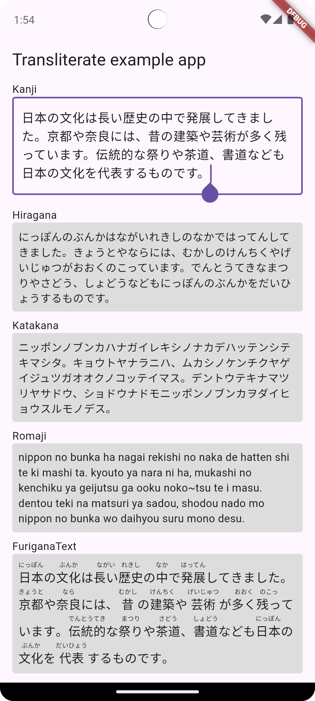

# Japanese Transliterate

[](https://pub.dev/packages/jp_transliterate)

A Flutter plugin that converts Japanese kanji into kana (hiragana and katakana) and romaji, supporting academic apps, translation apps, kanji reading and writing support features, phonetic annotation, or search queries like those in Elasticsearch.



## Install
```yaml
dependencies:
  jp_transliterate: ^1.0.4
```

## Example

```dart
  final input = '日本の文化';
  if (JpTransliterate.isKanji(input: input)) {
    final data = await JpTransliterate.transliterate(kanji: input);
    print('Data transliterated: $data');
    // Output: Data transliterated: TransliterationData{kanji: 日本の文化, romaji: nippon no bunka, hiragana: にっぽんのぶんか, katakana: ニッポンノブンカ}
  }
```

## Features

- [x] Transliterate kanji to hiragana, katakana and romaji.
- [x] Transliterate kanji to list of words.
- [x] Transliterate hiragana to katakana and vice versa.
- [x] Transliterate katakana to romaji.
- [x] Check if a string is kanji, hiragana or katakana.
- [x] A `FuriganaText` widget that presents text with transliteration annotations positioned above.

## Roadmap

*No plan. If you have any ideas, please contribute.*

